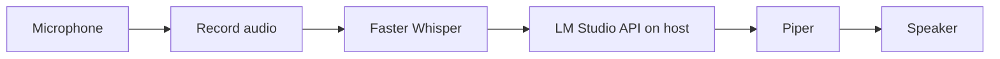
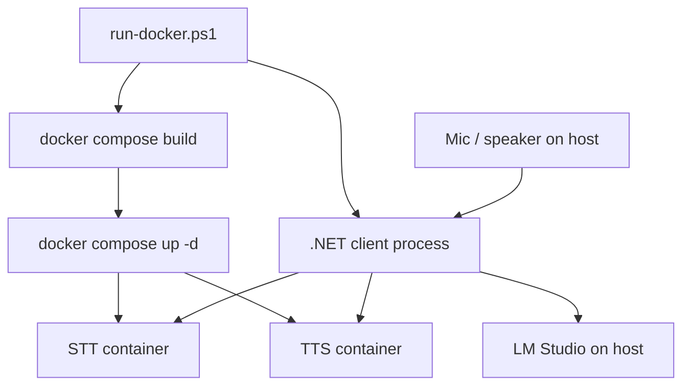

# Project Specification: AI Voice Test (POC)

## 1. Purpose

Build a proof-of-concept (POC) console application that enables **voice conversation with a local large language model (LLM)**. The user speaks; the app transcribes speech, sends the text to a locally hosted LLM, receives a text reply, and speaks that reply aloud.

Primary goals:

1. Demonstrate an end-to-end local voice loop (speech in, speech out) without cloud LLM APIs.
2. Keep the host application on **.NET** with a rich terminal UI via **Spectre.Console**.
3. Delegate specialized audio and ML workloads to mature external tools (Faster Whisper, Piper) and the LLM runtime (LM Studio).
4. Provide a single **run entry point** (`utils/run-docker.ps1`) that builds containerized dependencies and starts the client (LM Studio remains a separate manual step).

## 2. Scope

### 2.1 In scope (POC)

1. Console-based voice interaction session (push-to-talk or record-until-silence for v1).
2. Speech-to-text using **Faster Whisper**.
3. LLM chat completion using **LM Studio** local server API.
4. Text-to-speech using **Piper**.
5. Conversation history for multi-turn dialogue (in-memory for POC).
6. Configuration via `data/` (endpoints, model paths, audio device hints).
7. Clear status output in the terminal (listening, transcribing, thinking, speaking).
8. **`utils/run-docker.ps1`**: build Docker images, provision STT/TTS (and related) dependencies, then invoke and run the .NET client.
9. **Incremental runnable milestones** - from Phase 2 onward, each implementation phase ends with `.\utils\run-docker.ps1` launching a build where a **new, distinct** capability is visible (see section 17).
10. **Speech echoed as text** - all spoken user input and all assistant replies are shown in the terminal as text (see section 18).
11. **`self-test` mode** - renames the existing `mic-test`; concurrently captures microphone input while **broadcasting** a configurable phrase through speakers (see section 19).

### 2.2 Out of scope (POC)

1. Real-time streaming STT, streaming LLM tokens, or streaming TTS.
2. Full-duplex barge-in (interrupting the assistant while it speaks).
3. Web UI, mobile clients, or telephony integration.
4. User authentication, multi-user support, or persistent chat storage.
5. Cloud-hosted STT, TTS, or LLM services.
6. **Dockerized or scripted LM Studio** - the LLM server is always started and managed by the user outside this script.

Future phases may add VAD-based hands-free mode, streaming, and a graphical UI; they are not required for the initial POC.

## 3. Technology Stack

| Layer | Technology | Role |
|-------|------------|------|
| Host application | .NET 8+ console app | Orchestration, configuration, session loop |
| Terminal UI | Spectre.Console | Panels, prompts, status spinners, formatted output |
| LLM | LM Studio | Local model inference; OpenAI-compatible HTTP API (host, not in Docker script) |
| Speech-to-text | Faster Whisper | Offline transcription of recorded utterances |
| Text-to-speech | Piper | Offline synthesis of assistant replies to WAV/audio |
| Audio I/O | TBD in implementation (e.g. NAudio on Windows) | Microphone capture and speaker playback |
| Helper scripts | `utils/` (Python/shell as needed) | Thin wrappers to invoke Whisper/Piper with stable CLI contracts |
| Runtime packaging | Docker + Docker Compose | Reproducible STT/TTS (and related) dependency images |
| Run orchestration | `utils/run-docker.ps1` (PowerShell) | Build, setup, and launch client in one command |

### 3.1 LM Studio (LLM)

- User runs LM Studio locally and starts the **local server** (default commonly `http://localhost:1234`).
- The .NET app calls the **OpenAI-compatible** chat completions endpoint (e.g. `POST /v1/chat/completions`).
- Configuration (in `data/`): base URL, model id/name, temperature, max tokens, system prompt.
- The POC assumes LM Studio is already running before the app starts; the app should detect connection failure and show a clear Spectre error message.
- **`utils/run-docker.ps1` does not start, install, or configure LM Studio.** README must state this explicitly before run.

### 3.2 Faster Whisper (STT)

- Used for **batch** transcription of a recorded audio segment (WAV or similar), not live partial transcripts in v1.
- Invoked from the .NET app via a documented process contract (recommended: Python script in `utils/` using the `faster-whisper` package, or HTTP/gRPC to a containerized STT service exposed by Docker).
- Configuration: model size (e.g. `base`, `small`), device (`cpu` / `cuda`), compute type, language (optional, default auto).
- Output: plain text transcript passed to the LLM layer.
- Docker image build and service startup are owned by `utils/run-docker.ps1` (see section 16).

### 3.3 Piper (TTS)

- Used to synthesize assistant reply text to an audio file or stdout stream for playback.
- Invoked via Piper CLI or a small wrapper in `utils/`, or via a containerized TTS service.
- Configuration: path to Piper executable or service URL, voice model (`.onnx` + `.onnx.json`), output format/sample rate.
- Output: audio played through the default output device after synthesis completes.
- Docker image build and service startup are owned by `utils/run-docker.ps1` (see section 16).

### 3.4 Spectre.Console (UI)

- Welcome banner and short usage instructions.
- Live status during pipeline steps (e.g. `Status().Start("Transcribing...")`).
- **Speech echo panel** - every transcribed user utterance and every assistant reply rendered as text (see section 18).
- Optional: `SelectionPrompt` for settings (push-to-talk vs. record duration) in later iterations.
- Errors surfaced with consistent styling (red markup, exit codes documented in README when implemented).
- Display current **phase capability** or build label in the banner so incremental milestones are obvious during development.

## 4. Architecture

### 4.1 High-level pipeline



### 4.2 Deployment view (Docker + host)



The .NET client runs on the **host** (recommended for Windows microphone/speaker access in POC). STT and TTS run in **Docker**. LM Studio runs on the **host** only.

### 4.3 Logical components (.NET)

The solution under `src/` should separate concerns:

1. **Presentation** - Spectre.Console session loop, user prompts, status display.
2. **Services (interfaces)** - `IAudioCaptureService`, `IAudioPlaybackService`, `ISpeechToTextService`, `ILlmChatService`, `ITextToSpeechService`, `IVoiceSessionOrchestrator`.
3. **Infrastructure** - HTTP client for LM Studio; process runners or HTTP clients for Whisper/Piper; file temp directory for intermediate WAV files.
4. **Configuration** - bound from `data/appsettings.json` (or equivalent) with validation on startup.

Dependency injection (Microsoft.Extensions.DependencyInjection) is required for service registration and testability.

### 4.4 Session loop (POC v1)

1. Initialize configuration and verify LM Studio reachable.
2. Display ready state; wait for user trigger (e.g. press Enter for push-to-talk).
3. Record audio until release or fixed duration (POC: push-to-talk is acceptable minimum).
4. Run STT -> obtain user message text.
5. Append user message to conversation history; call LM Studio chat API with history.
6. Append assistant message to history; run TTS on assistant text.
7. Play audio; return to step 2 until user exits (e.g. `q`).

### 4.5 External process contract

Whisper and Piper integrations must be documented in `docs/build.md` (when added) with:

1. Exact command lines and arguments (host CLI) or HTTP endpoints (containerized).
2. Expected input/output file paths under a temp folder (e.g. `data/temp/` gitignored).
3. Exit codes and stderr handling.
4. Prerequisites (Python version, pip packages, Piper binary path) when not using Docker.

The .NET app must not embed Python; it invokes `utils/` scripts, container endpoints, or installed CLIs.

## 5. Project Layout

Per `claude.md` / `AGENTS.md`:

```
ai-voice-test/
  AGENTS.md
  README.md
  claude.md
  utils/
    run-docker.ps1      # Primary run script (build Docker deps, launch client)
  data/                 # Configuration, optional persisted session (POC: config only)
  docs/
    spec.md             # This document
    todo.md             # Phased implementation tasks
  src/                  # .NET solution and main application project
  tests/                # Unit and integration tests
  utils/                # Whisper/Piper helper scripts, setup notes
  agents/               # Local only, gitignored
```

Docker assets (exact paths finalized in implementation):

```
docker/
  docker-compose.yml    # STT, TTS services (and optional shared base)
  Dockerfile.stt        # Faster Whisper environment (or single multi-stage Dockerfile)
  Dockerfile.tts        # Piper environment
```

Suggested .NET solution structure (to be created during implementation):

```
src/
  AiVoiceTest.sln
  AiVoiceTest/                    # Console host, Spectre UI
  AiVoiceTest.Core/               # Interfaces, models, orchestration
  AiVoiceTest.Infrastructure/     # LM Studio HTTP, STT/TTS clients
```

## 6. Functional Requirements

1. The application shall run as a .NET console executable on Windows (primary target for POC).
2. The user shall be able to complete at least one full voice turn: speak -> hear LLM reply as speech.
3. The application shall **echo all spoken user input as text** in the terminal immediately after STT completes (section 18).
4. The application shall **echo all assistant replies as text** in the terminal whenever the assistant responds (before or alongside TTS playback).
5. The application shall maintain in-memory chat history for the session and send prior turns to LM Studio.
6. The application shall read settings from `data/` without hard-coding secrets or machine-specific paths in source.
7. The application shall fail gracefully if LM Studio, Whisper, or Piper is unavailable, with actionable messages.
8. The user shall be able to exit the session cleanly from the console.
9. **`utils/run-docker.ps1`** shall build all required Docker images, start dependent services, and launch the .NET client in one invocation from the repository root.
10. **`utils/run-docker.ps1`** shall not install, start, or configure LM Studio; it may print a reminder if the LLM endpoint is unreachable after the client starts.
11. **From Phase 2 completion onward**, each numbered implementation phase in `docs/todo.md` shall end with a **phase gate**: `.\utils\run-docker.ps1` runs successfully and demonstrates one new, distinct user-visible behavior (section 17).
12. **`self-test` mode** shall replace `mic-test` (section 19): simultaneous microphone capture and TTS broadcast of `SelfTest:Phrase`; phrase text echoed in the terminal.

## 7. Non-Functional Requirements

1. **Latency** - POC target: end-to-end turn under 10 seconds on typical hardware for short utterances and replies (not a hard SLA).
2. **Privacy** - Audio and inference remain local; no telemetry in POC.
3. **Testability** - Core orchestration testable with mocked STT/LLM/TTS interfaces; HTTP client mockable for LM Studio.
4. **Maintainability** - Async/await for all I/O; no blocking calls on UI thread equivalents.
5. **Documentation** - README updated when features land; `todo.md` tracks implementation phases.
6. **Reproducibility** - `utils/run-docker.ps1` should be idempotent for build/up (safe to re-run); document Docker Desktop prerequisite on Windows.

## 8. Configuration

Example configuration keys (file name and schema finalized in implementation):

| Key | Description | Example |
|-----|-------------|---------|
| Llm:BaseUrl | LM Studio server URL (host) | `http://localhost:1234` |
| Llm:Model | Model identifier LM Studio exposes | `local-model` |
| Llm:SystemPrompt | Optional system message | `You are a helpful assistant.` |
| Stt:Mode | `process` or `http` | `http` |
| Stt:ServiceUrl | STT container base URL | `http://localhost:5001` |
| Stt:WhisperScriptPath | Path to utils STT script (process mode) | `utils/transcribe.py` |
| Stt:ModelSize | Faster Whisper model | `small` |
| Stt:Device | `cpu` or `cuda` | `cpu` |
| Tts:Mode | `process` or `http` | `http` |
| Tts:ServiceUrl | TTS container base URL | `http://localhost:5002` |
| Tts:PiperPath | Piper executable (process mode) | `C:/Tools/piper/piper.exe` |
| Tts:VoiceModelPath | ONNX voice model | `data/voices/en_US-lessac-medium.onnx` |
| Audio:InputDeviceId | Optional mic selection | null = default |
| Audio:SampleRate | Recording sample rate | `16000` |
| Session:MaxHistoryMessages | Cap history sent to LLM | `20` |
| SelfTest:Phrase | Text spoken aloud during self-test (TTS broadcast) | `I never did mind about the little things` |
| SelfTest:DurationSeconds | How long mic capture runs concurrently with broadcast | `10` |

Sensitive values must not be committed. Document required external installs in README.

## 9. Prerequisites (developer machine)

1. **.NET SDK** 8.0 or later.
2. **Docker Desktop** (or compatible Docker engine) on Windows.
3. **PowerShell** 5.1+ or PowerShell 7+ (to execute `utils/run-docker.ps1`).
4. **LM Studio** installed; a chat/instruct model loaded; **local server started manually** before or during client run.
5. Working microphone and speakers (headset recommended) on the host for the .NET client.
6. Optional: NVIDIA GPU and CUDA for faster Whisper inference in the STT container (documented when supported).

Manual install of Python/Piper on the host is **not** required when using the Docker-based run path.

## 10. LM Studio API Integration

1. Use `HttpClient` with configurable `BaseAddress` from settings.
2. Request format: OpenAI-style chat completions JSON (`messages` array with `role` and `content`).
3. Parse assistant `choices[0].message.content` from response.
4. Handle HTTP errors, timeouts, and empty responses with retriable vs. fatal classification (POC: single retry optional).
5. Do not assume a specific model vendor; model name comes from configuration.
6. From containers, use `host.docker.internal` only for services the spec places in Docker; LM Studio is always called from the host client to `localhost` (or configured host URL).

## 11. Testing Strategy

1. **Unit tests** - Orchestrator logic, history management, configuration validation, message building for LM Studio.
2. **Integration tests** - Optional, gated: require LM Studio running; mark as explicit/skipped in CI.
3. **Manual POC test** - Run `.\utils\run-docker.ps1` with LM Studio up; record short phrase, verify transcript, verify spoken reply, verify multi-turn context.

Follow `claude.md` testing rules: AAA pattern, no test-only production code paths, one behavior per unit test.

## 12. Acceptance Criteria (POC complete)

1. Solution builds from `src/` without errors.
2. `.\utils\run-docker.ps1` builds images, starts STT/TTS services, and launches the client without manual Docker commands.
3. With LM Studio running on the host, user completes a voice Q&A turn from the console.
4. **Every user utterance** appears as text in the terminal after speaking (speech echo).
5. **Every assistant reply** appears as text in the terminal; TTS audio is in addition to text, not a substitute.
6. Assistant reply is audible through local playback.
7. Second turn demonstrates the model receives prior context (e.g. follow-up question about earlier answer).
8. Missing dependency (Docker down, LM Studio down, service unhealthy) produces a clear error and non-zero exit code.
9. Each phase gate in section 17 has been demonstrated at least once before POC sign-off.
10. `README.md` documents setup, `utils/run-docker.ps1`, configuration, phase milestones, and LM Studio prerequisite; `todo.md` reflects completed phases.

## 13. Risks and Mitigations

| Risk | Mitigation |
|------|------------|
| Whisper/Piper are not native .NET | Containerized services + stable API; optional host CLI fallback in config |
| LM Studio API surface changes | Use documented OpenAI-compatible endpoints only |
| Audio device access from Docker | Run .NET client on host; only STT/TTS in containers for POC |
| LM Studio not running | Pre-flight check in client; script prints reminder, does not start LM Studio |
| High end-to-end latency | Small Whisper model; small/fast LLM in LM Studio; short replies in system prompt |
| Large temp files | Delete temp WAV after each turn; gitignore `data/temp/` |
| Docker build time on first run | Document first-run expectations; layer caching in Dockerfiles |

## 14. References

1. LM Studio - https://lmstudio.ai/
2. Faster Whisper - https://github.com/SYSTRAN/faster-whisper
3. Piper - https://github.com/rhasspy/piper
4. Spectre.Console - https://spectreconsole.net/
5. Docker Compose - https://docs.docker.com/compose/

## 15. Related Documents

1. `docs/todo.md` - Phased implementation checklist (derived from this spec).
2. `README.md` - Setup, run instructions, and feature status.
3. `claude.md` / `AGENTS.md` - Project rules and agent workflows.
4. `docs/build.md` - To be added: Docker build details, compose services, and troubleshooting.

## 16. Run orchestration: `run-docker.ps1`

### 16.1 Purpose

Provide a single PowerShell script at the repository root so developers can **build, provision, and run** the POC without manually installing Python, Piper, or Faster Whisper on the host. The LLM (LM Studio) remains outside this automation.

### 16.2 Location and invocation

- **Path:** `utils/run-docker.ps1`.
- **Invocation:** `.\utils\run-docker.ps1` from the repo root in PowerShell (or `.\run-docker.ps1` from `utils/`).
- Optional parameters (implementation): `-SkipBuild`, `-DetachOnly`, `-Configuration Release` - document in README when implemented.

### 16.3 Responsibilities (in order)

1. **Preflight** - Verify Docker CLI is available and the engine is running; fail fast with a clear message if not.
2. **Build** - Run `docker compose build` (or equivalent) for all project-defined images (STT, TTS, and any shared base).
3. **Setup** - Run `docker compose up -d` to start dependent services; wait until health checks pass (or documented ports respond).
4. **Client build** - `dotnet build` the solution under `src/` (Release for POC unless documented otherwise).
5. **Invoke client** - `dotnet run` on the console project (or execute built DLL) with working directory and environment so `data/` configuration resolves correctly.
6. **Propagate exit code** - Client process exit code becomes the script exit code.

### 16.4 Explicit non-responsibilities

1. Does **not** download, install, or start LM Studio.
2. Does **not** download LLM weights into the project.
3. Does **not** modify global machine Python or .NET installations beyond using the installed SDK for `dotnet build` / `dotnet run`.

### 16.5 LM Studio expectation

Before or immediately after launch, the user must:

1. Open LM Studio.
2. Load a model.
3. Start the local server (e.g. port 1234).

If the client cannot reach `Llm:BaseUrl`, show an error that names LM Studio and the configured URL. `utils/run-docker.ps1` may echo a one-line reminder before starting the client.

### 16.6 Client vs. container placement

| Component | Runs in |
|-----------|---------|
| Faster Whisper (STT) | Docker (default for `utils/run-docker.ps1` path) |
| Piper (TTS) | Docker (default for `utils/run-docker.ps1` path) |
| .NET voice client | Host (Windows) |
| LM Studio | Host (user-managed) |
| Microphone / speakers | Host |

### 16.7 Acceptance criteria (`run-docker.ps1`)

1. Fresh clone: after Docker and .NET SDK are installed and LM Studio is running, `.\utils\run-docker.ps1` is sufficient to reach the interactive voice session (no manual `docker compose` or `dotnet run` steps).
2. Re-running the script after a successful run does not require manual cleanup of containers for normal development.
3. Script fails with non-zero exit code and readable errors when Docker is stopped or compose build fails.
4. README documents the script, prerequisites, and LM Studio exclusion.
5. From Phase 2 onward, completing any implementation phase without a passing phase gate (section 17) is considered incomplete work.

## 17. Incremental phase deliverables (runnable milestones)

### 17.1 Principle

Implementation is split so that **after each phase** the developer can run the app and observe **one new, distinct** capability. This validates integration early and avoids a single big-bang integration at the end.

- **Phase 1** ends with `dotnet run` from `src/` (Docker not required yet).
- **Phase 2 and later** end with `.\utils\run-docker.ps1` as the standard run path.
- Each phase lists a **phase gate**: concrete steps to verify the new behavior. A phase is not complete until its gate passes.
- The console banner or status line should indicate the current milestone (e.g. `Milestone: STT echo`) so demos are unambiguous.

### 17.2 Phase gates (aligned with `docs/todo.md`)

| Phase | Run command | New distinct behavior (demo) | LM Studio required? |
|-------|-------------|------------------------------|---------------------|
| 1 | `dotnet run --project src/AiVoiceTest` | Spectre welcome UI; loaded config summary; clean exit | No |
| 2 | `.\utils\run-docker.ps1` | Docker STT/TTS containers build and start; client shows service health (reachable / not) | No |
| 3 | `.\utils\run-docker.ps1` | Record speech (push-to-talk); **spoken words appear as text** (`You said: ...`) | No |
| 4 | `.\utils\run-docker.ps1` | After speech echo, **assistant text reply** from LM Studio (`Assistant: ...`) | Yes |
| 5 | `.\utils\run-docker.ps1` | Assistant reply **spoken aloud** via Piper; text echo still shown | Yes |
| 5b | `.\utils\run-docker.ps1 -SelfTest` or `dotnet run -- --self-test` | **Self-test**: mic captures while configured phrase is **broadcast**; `Broadcast:` line in console | No (LM Studio); TTS required for broadcast |
| 6 | `.\utils\run-docker.ps1` | **Multi-turn**: second question uses prior context; session log shows both turns as text | Yes |
| 7 | `dotnet test` + `.\utils\run-docker.ps1` | Automated tests pass; full POC checklist (section 12) | Yes |

Phases must not be merged in a way that skips a visible milestone. If a phase is split further in `todo.md`, each sub-phase still needs its own gate or an explicit combined gate documented in `todo.md`.

### 17.3 Phase gate checklist (template)

For each phase completion, record:

1. Run command executed.
2. What new UI or output appeared that did not exist in the previous phase.
3. Screenshot or log snippet optional; behavior must be reproducible by another developer following README.

## 18. Speech echoed as text

### 18.1 Requirement

**Everything that is spoken in the conversation must appear as text in the terminal.** Audio alone is insufficient for user or assistant output.

### 18.2 User speech

1. After each recording + STT pass, print the transcript prominently, e.g. label `You said:` followed by the recognized text.
2. Show the transcript even when the pipeline stops early (e.g. LM Studio down in later phases) - Phase 3 gate depends on this.
3. If STT returns empty or low-confidence silence, print an explicit message (e.g. `You said: (no speech detected)`) rather than omitting output.
4. Keep a **session transcript** region or rolling log in Spectre (panel, table, or markup block) so prior user lines remain visible during the session.

### 18.3 Assistant speech

1. When the LLM returns a reply, print `Assistant:` followed by the full text **before** starting TTS playback (Phase 4+).
2. When TTS plays audio (Phase 5+), the text echo must remain visible; do not clear assistant text when audio starts.
3. Assistant text echo is required even if TTS fails (show text; report audio error separately).

### 18.4 Formatting (Spectre.Console)

1. Use consistent labels (`You said:`, `Assistant:`) and visually distinct markup (e.g. colour) for user vs. assistant lines.
2. Optional timestamps per line; not required for POC.
3. Status spinners (`Transcribing...`, `Thinking...`) are additive and do not replace transcript echo.

### 18.5 Acceptance criteria (speech echo)

1. Speak a short sentence in Phase 3+; the same meaning appears as text within one turn.
2. Complete a full turn in Phase 5+; both user and assistant strings are visible in the session log.
3. No code path plays assistant audio without printing assistant text first.
4. README "Implemented" section mentions speech-to-text echo when Phase 3+ ships.

## 19. Self-test mode (`self-test`, replaces `mic-test`)

### 19.1 Purpose

Provide a **hardware and audio-path diagnostic** that validates microphone capture and speaker playback **at the same time**, using a known phrase. This replaces the current `mic-test` flow (record-only, optional playback of the recording) with a more realistic **simultaneous listen + broadcast** test.

Use cases:

1. Confirm mic and speakers work before a voice session.
2. Detect obvious issues (mute, wrong device, no playback) without LM Studio or full STT/LLM loop.
3. Optional: compare captured audio to the broadcast phrase when STT is available.

### 19.2 Rename (`mic-test` -> `self-test`)

The existing `mic-test` entry points are **renamed** (not duplicated):

| Current (remove or deprecate) | New |
|------------------------------|-----|
| `--mic-test` | `--self-test` |
| `--mic-test-seconds=N` | `--self-test-seconds=N` (optional; may default from `SelfTest:DurationSeconds`) |
| `-MicTest` (`utils/run-docker.ps1`) | `-SelfTest` |
| `-MicTestSeconds` | `-SelfTestSeconds` |
| `MicTestArgs`, `MicTestRunner` | `SelfTestArgs`, `SelfTestRunner` (or equivalent) |

**Deprecation:** `--mic-test` and `-MicTest` may be accepted as **aliases** for one release with a console warning directing users to `self-test`. Documentation and README use only `self-test`.

### 19.3 Configuration (`data/appsettings.json`)

```json
"SelfTest": {
  "Phrase": "I never did mind about the little things",
  "DurationSeconds": 10
}
```

1. **`SelfTest:Phrase`** (required) - exact text synthesized and played through speakers during self-test. Default: `I never did mind about the little things`.
2. **`SelfTest:DurationSeconds`** (optional) - length of the concurrent capture/broadcast window. Default: `10`. CLI `--self-test-seconds` overrides when supplied (valid range: 2-60, same as current mic-test).

### 19.4 Behavior (simultaneous listen + broadcast)

When self-test runs:

1. Print Spectre banner: **Self-test** (not "Microphone test").
2. Show audio device list (retain current helpful output).
3. Print **`Broadcast: <SelfTest:Phrase>`** in the terminal (text echo of what will be spoken).
4. **At the same time** (within the same test window):
   - **Broadcast** - synthesize `SelfTest:Phrase` via TTS (Piper / TTS container) and play through the default output device.
   - **Listen** - capture microphone input to a WAV buffer/file for the duration (`SelfTest:DurationSeconds` or CLI override).
5. Overlap must be **concurrent**, not sequential (no "play phrase, then record" for the primary path).
6. After the window ends:
   - Report peak level / duration for the captured audio (retain useful mic-test metrics).
   - Optionally offer playback of the **captured** recording (secondary, not a substitute for broadcast).
7. If TTS is unavailable, fail with a clear message (self-test requires broadcast capability).

### 19.5 Optional STT verification (recommended when Docker STT is up)

When the STT service is reachable (e.g. `.\utils\run-docker.ps1 -SelfTest` started TTS and optionally STT):

1. Transcribe the captured WAV.
2. Print **`Heard: <transcript>`** (speech echo of what the mic picked up).
3. Show a simple comparison hint (exact match not required for POC): e.g. display both `Broadcast:` and `Heard:` lines side by side; warn if `Heard` is silence or wildly different.

STT verification is optional for `dotnet run -- --self-test` without Docker; broadcast + capture still must run if TTS is available locally.

### 19.6 Run paths

| Command | Docker | LM Studio | TTS for broadcast |
|---------|--------|-----------|-------------------|
| `dotnet run --project src/AiVoiceTest -- --self-test` | No | No | Host TTS fallback or fail with setup hint |
| `.\utils\run-docker.ps1 -SelfTest` | Start **TTS** (and STT if needed for `Heard:`) | No | Piper container |
| `.\docker-run.ps1 -SelfTest` | Same (wrapper) | No | Piper container |

`run-docker.ps1 -SelfTest` does **not** start LM Studio and does **not** launch the full voice session.

### 19.7 UI labels (Spectre)

1. `Broadcast:` - configured phrase (always).
2. `Heard:` - STT transcript of capture when available (optional).
3. Retain peak level meter and device name from current mic-test where still applicable.
4. Completion message references `--self-test`, not `--mic-test`.

### 19.8 Acceptance criteria (self-test)

1. `SelfTest:Phrase` in `appsettings.json` defaults to `I never did mind about the little things` when unset in code defaults.
2. `.\utils\run-docker.ps1 -SelfTest` plays that phrase through speakers **while** the mic is recording.
3. Terminal shows `Broadcast: I never did mind about the little things` (or configured override).
4. `--mic-test` is no longer documented; `--self-test` is documented in README and `utils/README.md`.
5. Changing `SelfTest:Phrase` in config changes the spoken and displayed phrase without recompile (config reload on startup).
6. No LM Studio dependency for self-test.
